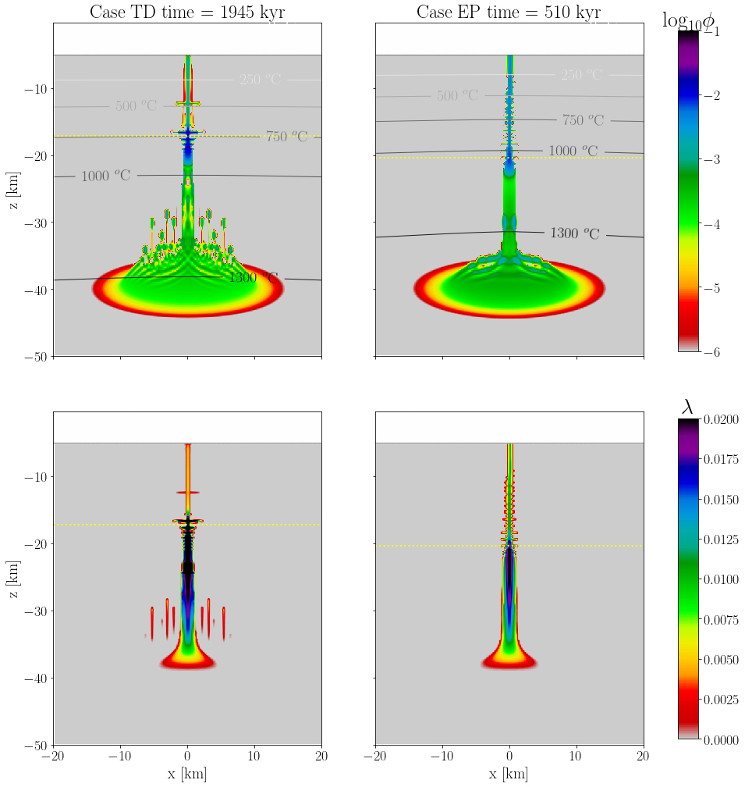
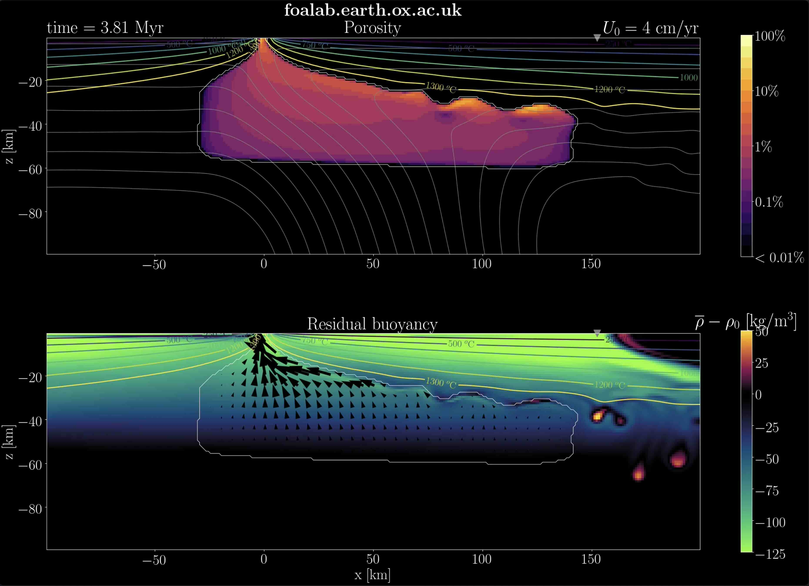

# FD-PDE Framework (Release version)
Release version of the **FD-PDE framework** developed for magma dynamics and other applications in geodynamics.

The FD-PDE Framework was created within the **RIFT-O-MAT** (Magma-Assisted Tectonics) project, funded by the European Research Council under Horizon 2020 research and innovation program, and awarded to PI Richard Katz. The goal of the RIFT-O-MAT project is to create analytical and numerical tools to understand how magmatism promotes and shapes rifts in continental and oceanic lithosphere.

## License: MIT License

## Contributors
- Adina E. Pusok
- Dave May
- Yuan Li
- Richard Katz

## Publications using the FD-PDE framework
- Pusok, A. E., Li, Y., Davis, T., May, D. A. and Katz, R. F. (2025). Inefficient melt transport across a weakened lithosphere led to anomalous rift architecture in the Turkana Depression. GRL.

- Li. Y., Davis, T., Pusok, A.E., Katz, R.F. (2025). Models of buoyancy-driven dykes using continuum plasticity and fracture mechanics: a comparison. GMD, EGUsphere (preprint), doi: [10.5194/egusphere-2024-3504](https://egusphere.copernicus.org/preprints/2024/egusphere-2024-3504/).

- Li, Y., Pusok, A. E., Davis, T., May, D. and Katz, R. F. (2023). Continuum approximation of dyking with a theory for poro-viscoelastic–viscoplastic deformation. Geophys. J. Int., 234(3):2007–2031. doi: [10.1093/gji/ggad173](http://doi.org/10.1093/gji/ggad173).

- Pusok, A. E., Katz, R. F., May, D. A. and Li, Y. (2022). Chemical heterogeneity, convection and asymmetry beneath mid-ocean ridges. Geophys. J. Int., 231(3):2055–2078. doi: [10.1093/gji/ggac309](http://doi.org/10.1093/gji/ggac309).

## Manual and benchmarks
Documentation for the FD-PDE Framework and tests can be found here: [FD-PDE Benchmarks (pdf)](https://drive.google.com/file/d/1eMRSPnwmhr6tx4p1jTDj8rqTavWykSwH/view?usp=sharing).

## Citing the FD-PDE framework
Original publication:
- Pusok, A. E., Katz, R. F., May, D. A. and Li, Y. (2022). Chemical heterogeneity, convection and asymmetry beneath mid-ocean ridges. Geophys. J. Int., 231(3):2055–2078. doi: [10.1093/gji/ggac309](http://doi.org/10.1093/gji/ggac309).

Versions:
- Pusok, A. E., May, D. A., Li, Y., Davis, T., Katz, R. F. (2025), FD-PDE framework, morfault: v2.0.0. doi: tbc.

- Pusok, A. E., May, D. A., Li, Y., Katz, R. F. (2022), FD-PDE framework: v1.0.0. doi:[10.5281/zenodo.6900871](http://doi.org/10.5281/zenodo.6900871).

## Repository contents
- `src/`: source code for FD-PDE framework
- `tests/`: tests for FD-PDE framework
- `models/`: model applications using the FD-PDE Framework
- `models/morfault/`: lithosphere extension and magma extraction model used in Pusok et al. (2025)
- `models/mbuoy3/`: mid-ocean ridge code used in [Pusok et al. (GJI, 2022)](http://doi.org/10.1093/gji/ggac309)
- `utils/`: python routines for I/O of PETSc objects

Each model is described below. 

## Description
The **FD-PDE framework** uses finite difference staggered grids for solving partial differential equations (PDEs) for single-/two-phase flow magma dynamics. The framework is based on [PETSc](https://petsc.org/release/) and makes use of the new features for staggered grids, such as DMStag. Governing equations are discretized as object PDEs (i.e., FDPDE Type), and the user only specifies coefficients, constitutive equations, and boundary conditions. 

Best way to get started with the FD-PDE framework is to first check the manual and run the tests located in `/FD-PDE/tests/`, and then explore the advanced applications in `/FD-PDE/models/`. If you are interested in using the FD-PDE for scientific applications and would need more assistance, please get in touch with A. Pusok. 

## Installing Dependencies
### PETSc
The PETSc version (v3.14) can be obtained from [petsc](https://gitlab.com/petsc/petsc.git):

`git clone -b maint https://gitlab.com/petsc/petsc.git petsc`

`git checkout v3.14`

<!-- Do `git pull` in the petsc directory anytime to obtain new patches that have been added. -->

Configure options (change `<PATH>` accordingly):

OPTIMIZED version recommended for model runs:

`./configure --prefix=<PATH_OPT> --FOPTFLAGS=-O2 --CXXOPTFLAGS=-O2 --COPTFLAGS=-O2 --download-fblaslapack --download-hdf5 --download-mumps --download-scalapack --download-parmetis --download-metis --download-cmake --with-debugging=0 --download-mpich --enable-shared --download-pastix --download-ptscotch --with-cxx-dialect=C++11 --download-superlu_dist --download-spooles --download-suitesparse --download-ml --download-hypre --download-hwloc --download-make`

DEBUG version recommended for code development (optional):

`./configure --prefix=<PATH_DEBUG> --download-fblaslapack --download-hdf5 --download-mumps --download-scalapack --download-parmetis --download-metis --download-cmake --with-debugging --download-mpich --enable-shared --download-pastix --download-ptscotch --with-cxx-dialect=C++11 --download-superlu_dist --download-spooles --download-suitesparse --download-ml --download-hypre --download-hwloc --download-make`

Specify PETSc environment variable for bash (in `~/.bashrc` or `~/.bash_profile`) or zsh shell:

`export PETSC_DIR=<PATH>`

### Python

Python3 is used for testing and post-processing. Preferred way to install python is through [anaconda3](https://www.anaconda.com) (multi-platform), which will install all the right executables. Check installation with: `which python`
and `which conda`.

<!-- Update anaconda (occasionally) with: `conda update --all` -->

To use the visualization tools developed within the FD-PDE Framework, update the environmental variable in the shell (change `<PATH_FDPDE>` accordingly):

`export PYTHONPATH=<PATH_FDPDE>/utils:${PETSC_DIR}/lib/petsc/bin`

## Tests 
To compile the tests, run the following in `FD-PDE/src/`:
- Clean executables: `make clean_all`
- Make executables: `make tests`

To run the tests in `FD-PDE/tests/`:
- Run individual test (example): `./test_fdpde`
- Run suite of tests: `python runApplicationTests.py` in `/FD-PDE/tests/python/`
- Visualization: using python examples in `/FD-PDE/tests/python/`.

# Models

## `morfault`

**Publication:** Pusok, A. E., Li, Y., Davis, T., May, D. A. and Katz, R. F. (2025). Inefficient melt transport across a weakened lithosphere led to anomalous rift architecture in the Turkana Depression. GRL.

**morfault** is a 2-D lithosphere extension and magma extraction model. It couples magma transport with visco-elasto-viscoplastic rheology (Li et al., 2023). 

To compile the code, in `FD-PDE/models/morfault/`:
- Clean executable: `make clean_all`
- Make executable: `make all`

General command to run the model: `./morfault -options_file model_input.opts > log_out.out`
where `model_input.opts` is an input file and `log_out.out` is the code log file.

The input files are located in `FD-PDE/models/morfault/publication/input_files`. 
- Go to `morfault/publication/input_files/Case_EP` to reproduce results of case EP.
- Run `../../../morfault -options_file model_input.opts`

Post-processing and visualization scripts are located in `morfault/python` run:
* `python plot_fields.py`
* `plot_fields_3panels.py`

More output routines can be found in `vizMORfault.py`, which can be loaded as a module in any new script. Warning: paths need to be updated locally. 

*Results of melt extraction in the lithosphere using morfault. Maps represent porosity (top panels) and plastic strain (bottom panels); left: TD model with a thin, brittle layer and small Maxwell time, right: EP model with a thick, brittle layer and high Maxwell time.*

## `mbuoy3`

**Publication:** A.E. Pusok, R.F. Katz, D.A. May, Y. Li, Chemical heterogeneity, convection and asymmetry beneath mid-ocean ridges, *Geophysical Journal International*, Volume 231, Issue 3, December 2022, Pages 2055–2078, [DOI:10.1093/gji/ggac309](https://doi.org/10.1093/gji/ggac309)

**mbuoy3** is a 2-D mid-ocean ridge, two-phase flow model with buoyancy forces (porous, compositional, thermal). 

  

*Click on image to open Youtube video of small-scale convection near a mid-ocean ridge due to density fractionation by melt segregation.*

To compile the code, in `FD-PDE/models/mbuoy3/`:
- Clean executable: `make clean_all`
- Make executable: `make all`

Running the model: `./mbuoy3 -options_file model_half_ridge.opts > log_out.out`

### Test run
In `mbuoy3/test/` run:

1. Half-ridge model with:

`../mbuoy3 -options_file model_half_ridge.opts > log_out.out`

2. Full-ridge model with:

`../mbuoy3 -options_file model_full_ridge.opts > log_out.out`

The input files are actually identical, except for the option to switch on full-ridge mode: `-full_ridge 1`. This option will automatically extend the domain and adapt boundary conditions. 

### Visualization

First, make sure the `PYTHONPATH` is updated as indicated above. Then, install some cool [Scientific Colormaps](https://www.fabiocrameri.ch/colourmaps/) from Fabio Crameri with:
`pip install cmcrameri`

Example visualization for either the half-ridge/full-ridge test. In `mbuoy3/python` run:
* `python plot_debug_output.py`
* `python plot_time_series.py`
* `plot_HR_sims_porosity.py` - for half-ridge
* `plot_FR_sims_porosity.py` - for full-ridge

More output routines can be found in `vizMORBuoyancy.py`, which can be loaded as a module in any new script.

### Input files
Input files to reproduce the simulations in Pusok et al. (GJI, 2022) are found in `mbuoy3/publication/input_files/`. All parameter variations are indicated in the manuscript. Some nomenclature for half-ridge models:
* b000 - no buoyancy (passive flow)
* b100 - porous buoyancy
* b120 - porous and compositional buoyancy

Some nomenclature for full-ridge models:
* F1 - temperature forcing, can be modified with `-forcing 1 # 0-off, 1-Temp, 2-Comp`
* F2 - compositional forcing
* dTdx, dCdx - indicates magnitude of forcing
 
The `submit_job.run` are SLURM submission files, included to help with cpu and time usage, and how to restart a simulation from a specified timestep.

### pMELTs Jupyter notebook

To install `ThermoEngine` (Ghiorso et al., 2002, Ghiorso and Wolf, 2019), follow instructions from the [ENKI website](https://enki-portal.gitlab.io/ThermoEngine/index.html). In addition, you'll need to install and start [Docker](https://docs.docker.com) before running the ENKI server.

Copy the Jupyter notebooks:
* `MOR_beta_revised.ipynb`
* `MOR_beta_revised_min.ipynb`

in `ThermoEngine/Notebooks/my_notebooks/` to reproduce the pMELTS simulations in this study.

In the `ThermoEngine` directory, run the script `./run_docker_locally.sh` to start the ENKI server locally (JupyterLab session). Run the Jupyter notebooks within the JupyterLab session.

